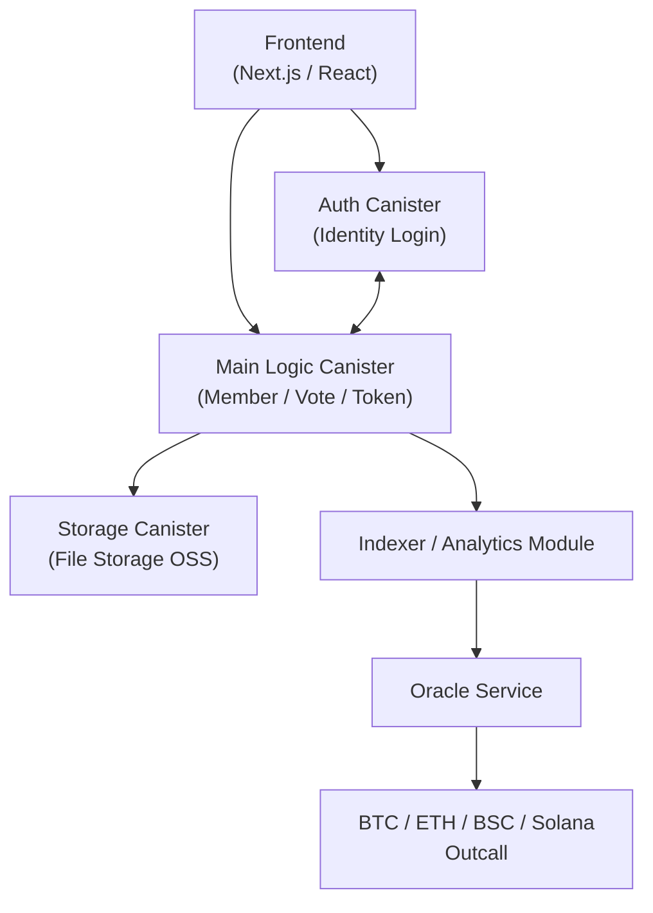

# `GovMind` — Autonomous Intelligence Layer for DAO Governance

**GovMind** is an advanced multi-chain governance infrastructure built on the **Internet Computer (ICP)**. It combines two powerful engines:

- 🔧 **Cross-Chain DAO Management Engine**  
- 🤖 **AI-Powered Governance Toolkit**

Together, they enable Web3 communities to create and operate **Intelligent DAOs (I-DAOs)** — organizations that can **govern autonomously, collaborate across chains, and scale with AI augmentation**.

---

## 🌐 Project Overview

In today’s DAO ecosystems, governance often suffers from low participation, poor proposal quality, complex rules, and disconnected multi-chain environments. **GovMind** introduces a dual-engine architecture to solve these structural issues:

### 🔧 Cross-Chain DAO Engine

- **Deploy DAOs on Ethereum, Bitcoin, Solana, ICP, TON, and more**
- Modular templates: foundation-style, committee-style, operations-style
- On-chain asset treasury (supporting ckBTC, ckETH, USDC, etc.)
- Customizable governance rules (e.g., voting thresholds, token-weighted voting)
- Full DAO lifecycle support: member onboarding, permissions, role transitions

### 🤖 AI Governance Toolkit

- **Proposal summarization, quality analysis, and structure generation via LLMs**
- **Debate simulation**: simulate support/opposition viewpoints before submission
- **AI delegate voting**: agents vote on behalf of users based on governance strategy
- **Cross-chain governance data analysis**: monitor DAO sentiment & vote patterns
- **Governance Reputation Score (GRS)**: on-chain user behavior scoring system
- **On-chain automation**: automatically execute passed proposals via canister agents

GovMind is not just a tool—it is a **decentralized operating system for DAOs**, ushering in a new era of **scalable, intelligent, and composable Web3 governance**.

---

## 🛠️ Key Technologies

| Technology | Purpose |
|------------|---------|
| **Internet Computer (ICP)** | Fully on-chain infrastructure with native HTTPS API support (HTTP Outcalls) |
| **Canister Architecture** | Modular components for AI analysis, data orchestration, DAO logic |
| **Chain-Key Technology** | Native control of Bitcoin, Ethereum assets without bridges |
| **Internet Identity** | Web3 login without wallets or seed phrases |
| **OpenAI API (via HTTP Outcall)** | On-chain proposal analysis and summarization |
| **ICP Timers** | Scheduled AI delegate voting and proposal scanning |
| **Stable Memory** | Persistent proposal data, user settings, and AI outputs |

---

## Project Architecture

