# GovMind Architecture Diagram

This document contains the comprehensive architecture diagram for the GovMind decentralized DAO operating system.

## System Architecture

```mermaid
%%{init: {"flowchart": {"defaultRenderer": "elk", "htmlLabels": true}} }%%
flowchart TB
    %% External Users and Systems
    subgraph EXT ["🌐 External Layer"]
        direction TB
        U("👥 Users & DAO Members<br/>🗳️ Governance Participants")
        AI("🤖 AI Services<br/>💡 DeepSeek & OpenAI<br/>📊 Analysis & Insights")
        BC("⛓️ Blockchain Networks<br/>🔗 Ethereum • Solana<br/>₿ Bitcoin • TON")
        SNS("🏛️ SNS Governance<br/>📋 Canister Registry<br/>⚖️ Proposal System")
        II("🔐 Internet Identity<br/>🛡️ Secure Authentication")
    end

    %% Frontend Layer
    subgraph FE ["💻 Frontend Layer"]
        direction LR
        WEB("⚛️ React Application<br/>⚡ Vite Build Tool<br/>🎨 TypeScript + TailwindCSS")
        AUTH("🔑 Authentication<br/>🆔 Internet Identity<br/>🔒 Session Management")
        QUERY("📡 React Query<br/>💾 State Management<br/>🔄 Data Caching")
    end

    %% API Proxy Layer
    subgraph API ["🛡️ API Proxy Layer"]
        direction TB
        PROXY("🚀 Node.js Proxy Server<br/>🌐 Express Framework<br/>⚡ Rate Limiting & Security<br/>🔐 CORS & Helmet Protection")
    end

    %% Internet Computer Protocol Layer
    subgraph ICP ["🏗️ Internet Computer Protocol"]
        direction TB

        %% Core Canisters
        subgraph CORE ["🎯 Core Canisters"]
            direction TB
            FACTORY("🏭 Factory Canister<br/>🆕 DAO Creation & Setup<br/>🌉 Cross-chain Assets<br/>⚙️ Configuration Management")
            BACKEND("🧠 Backend Canister<br/>💼 Core DAO Logic<br/>👥 Member Management<br/>💰 Treasury Operations")
            ANALYZER("🔍 Proposal Analyzer<br/>🤖 AI-Powered Analysis<br/>⚠️ Risk Assessment<br/>📊 Complexity Scoring")
            SNS_INT("🔗 SNS Integration<br/>🔄 Governance Sync<br/>📋 Proposal Aggregation<br/>📊 Data Harmonization")
        end

        %% Shared Components
        subgraph SHARED ["🔧 Shared Components"]
            direction LR
            TYPES("📝 Shared Types<br/>🏗️ Data Structures<br/>🔗 Common Interfaces")
            LEDGER("💳 ICRC-1 Ledger<br/>🪙 Token Management<br/>💸 Transaction Processing")
            EVM_RPC("🌉 EVM RPC Bridge<br/>🔗 Cross-chain Calls<br/>⚡ Multi-network Support")
        end
    end

    %% Data Flow Connections - Primary
    U ==> WEB
    WEB ==> AUTH
    WEB ==> QUERY
    AUTH ==> II

    %% Frontend to Canisters
    WEB ==> FACTORY
    WEB ==> BACKEND
    WEB ==> ANALYZER
    WEB ==> SNS_INT

    %% AI Integration
    ANALYZER ==> PROXY
    PROXY ==> AI

    %% Inter-canister Communication
    FACTORY ==> BACKEND
    BACKEND ==> ANALYZER
    BACKEND ==> SNS_INT
    BACKEND ==> LEDGER

    %% External Integrations
    SNS_INT ==> SNS
    BACKEND ==> BC
    EVM_RPC ==> BC

    %% Shared Dependencies (dotted lines)
    FACTORY -.-> TYPES
    BACKEND -.-> TYPES
    ANALYZER -.-> TYPES
    SNS_INT -.-> TYPES

    %% Layout nudges for a cleaner look (invisible weak links)
    EXT ~~~ FE
    FE ~~~ API
    API ~~~ ICP

    %% Enhanced Styling
    classDef frontend fill:#e3f2fd,stroke:#1565c0,stroke-width:3px,color:#000
    classDef canister fill:#f3e5f5,stroke:#7b1fa2,stroke-width:3px,color:#000
    classDef external fill:#fff8e1,stroke:#f57c00,stroke-width:3px,color:#000
    classDef proxy fill:#e8f5e8,stroke:#388e3c,stroke-width:3px,color:#000
    classDef shared fill:#fce4ec,stroke:#c2185b,stroke-width:3px,color:#000
    classDef layer fill:#f5f5f5,stroke:#424242,stroke-width:2px,color:#000

    class WEB,AUTH,QUERY frontend
    class FACTORY,BACKEND,ANALYZER,SNS_INT canister
    class U,AI,BC,SNS,II external
    class PROXY proxy
    class TYPES,LEDGER,EVM_RPC shared
    class EXT,FE,API,ICP,CORE,SHARED layer

```

## Component Details

### Frontend Layer
- **React Frontend**: Modern web application built with React 18, TypeScript, and TailwindCSS
- **Authentication**: Internet Identity integration for secure user authentication
- **State Management**: React Query for efficient data fetching and caching

### API Proxy Layer
- **Node.js Proxy**: Express.js server handling AI API calls with security and rate limiting
- **Security Features**: CORS, Helmet, compression, and rate limiting
- **AI Integration**: Supports DeepSeek and OpenAI APIs for proposal analysis

### Core Canisters
- **Factory Canister**: Handles DAO creation, management, and cross-chain asset support
- **Backend Canister**: Core DAO logic, member management, and treasury operations
- **Proposal Analyzer**: AI-powered proposal analysis with complexity scoring and risk assessment
- **SNS Integration**: Synchronizes with SNS governance canisters and aggregates proposals

### Shared Components
- **Shared Types**: Common data structures and type definitions
- **ICRC-1 Ledger**: Token management following ICRC-1 standards
- **EVM RPC**: Cross-chain communication with Ethereum and other EVM-compatible networks

## Data Flow

1. **User Interaction**: Users interact with the React frontend through Internet Identity authentication
2. **DAO Operations**: Frontend communicates with core canisters for DAO management and operations
3. **AI Analysis**: Proposal analyzer uses the API proxy to communicate with external AI services
4. **Cross-chain Integration**: Backend canister and EVM RPC handle multi-blockchain operations
5. **Governance Sync**: SNS integration canister synchronizes with external governance systems

## Technology Stack

### Frontend
- React 18 with TypeScript
- Vite build tool
- TailwindCSS for styling
- React Query for state management
- Chart.js for data visualization
- Lucide React for icons

### Backend (Canisters)
- Rust programming language
- Internet Computer SDK (ic-cdk)
- Candid for interface definitions
- Stable structures for data persistence
- ICRC-1 standards for token operations

### API Proxy
- Node.js with Express.js
- Security middleware (Helmet, CORS)
- Rate limiting and compression
- Environment-based configuration

### External Integrations
- Internet Identity for authentication
- AI services (DeepSeek, OpenAI) for proposal analysis
- Multiple blockchain networks (Ethereum, Solana, Bitcoin, TON)
- SNS governance canisters for proposal aggregation

## Deployment Architecture

```mermaid
graph LR
    subgraph DEV_ENV ["🛠️ Development Environment"]
        DEV["🏠 Local dfx Replica<br/>🌐 localhost:4943<br/>⚡ Hot Reload & Testing"]
        PROXY_DEV["🔧 Development Proxy<br/>🌐 localhost:3001<br/>🔍 Debug Mode"]
        FRONTEND_DEV["💻 Vite Dev Server<br/>🌐 localhost:3000<br/>🔥 HMR & Live Reload"]
    end
    
    subgraph PROD_ENV ["🚀 Production Environment"]
        IC["🌍 Internet Computer<br/>⛓️ Mainnet Deployment<br/>🔒 Secure & Decentralized"]
        PROXY_PROD["☁️ Production Proxy<br/>🛡️ Load Balanced<br/>📊 Monitoring & Logs"]
        CDN["📦 Frontend Assets<br/>🏗️ IC Asset Canister<br/>⚡ Global Distribution"]
    end
    
    %% Deployment Flow
    DEV ==Deploy==> IC
    PROXY_DEV ==Deploy==> PROXY_PROD
    FRONTEND_DEV ==Build & Deploy==> CDN
    
    %% Enhanced Styling
    classDef dev fill:#e8f4fd,stroke:#1976d2,stroke-width:3px,color:#000
    classDef prod fill:#e8f5e8,stroke:#388e3c,stroke-width:3px,color:#000
    classDef env fill:#f9f9f9,stroke:#616161,stroke-width:2px,color:#000
    
    class DEV,PROXY_DEV,FRONTEND_DEV dev
    class IC,PROXY_PROD,CDN prod
    class DEV_ENV,PROD_ENV env
```

This architecture provides a scalable, secure, and decentralized platform for DAO governance with AI-powered analysis and cross-chain capabilities.